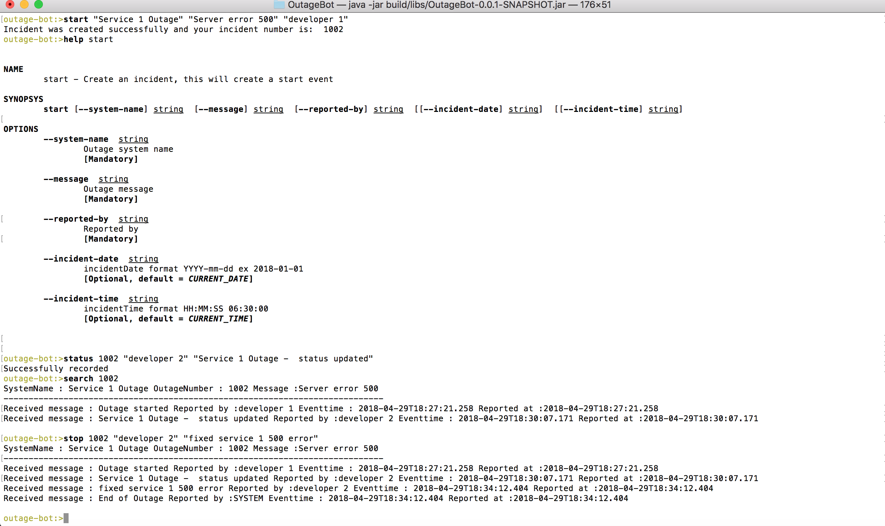

# Outage Bot

<br>
This application is to provide an interactive shell environment to record and search about outage of a system.

### Application Requirements:
- Java 1.8
- Spring Boot (Starter)
- Spring Shell

### Building and running the app standalone
```
Open terminal and goto the project folder.

-./gradlew build
-java -jar build/libs/OutageBot-0.0.1-SNAPSHOT.jar

```
### Available Commands


Built-In Commands
        clear: Clear the shell screen.
        exit, quit: Exit the shell.
        help: Display help about available commands.

Outage Commands
        search: Search an incident
        start: Create an incident, this will create a start event
        status: Report status an incident
        stop: End an incident


### Example usage of commands

1) start

Usage:
outage-bot:>start "Service 1 Outage" "Server error 500" "developer 1" 

Description:
Start or report an incident for the first time.

Response:
Incident was created successfully and your incident number is:  1002

2) status

Usage:
outage-bot:>status 1002 "developer 2" "Service 1 Outage -  status updated"

Description:
Update status of the outage using the outage number. If the outage is already closed, error message is displayed to user.

Response:
Successfully recorded

3) search

Usage:
outage-bot:>search 1002

Description:
Search an incident/outage that was created. It prints all the status of incident. Displays incident not found message, if the incident is not found.

Response:
SystemName : Service 1 Outage OutageNumber : 1002 Message :Server error 500
----------------------------------------------------------------------------
Received message : Outage started Reported by :developer 1 Eventtime : 2018-04-29T18:27:21.258 Reported at :2018-04-29T18:27:21.258
Received message : Service 1 Outage -  status updated Reported by :developer 2 Eventtime : 2018-04-29T18:30:07.171 Reported at :2018-04-29T18:30:07.171


4) stop

Usage:
outage-bot:>stop 1002 "developer 2" "fixed service 1 500 error"

Description:
If the incident or outage is fixed. Use the stop to provide the resolution and close the incident. Once the incident is closed, the outage cannot be updated later. This prints all the outage details.

Response:
SystemName : Service 1 Outage OutageNumber : 1002 Message :Server error 500
----------------------------------------------------------------------------
Received message : Outage started Reported by :developer 1 Eventtime : 2018-04-29T18:27:21.258 Reported at :2018-04-29T18:27:21.258
Received message : Service 1 Outage -  status updated Reported by :developer 2 Eventtime : 2018-04-29T18:30:07.171 Reported at :2018-04-29T18:30:07.171
Received message : fixed service 1 500 error Reported by :developer 2 Eventtime : 2018-04-29T18:34:12.404 Reported at :2018-04-29T18:34:12.404
Received message : End of Outage Reported by :SYSTEM Eventtime : 2018-04-29T18:34:12.404 Reported at :2018-04-29T18:34:12.404


5) help

Usage:
outage-bot:>help search

Description:
Used to display description of every command. 

Response:
NAME
	search - Search an incident

SYNOPSYS
	search [--outage-number] int  

OPTIONS
	--outage-number  int
		Outage number
		[Mandatory]

### Demo Screenshot

 

### Error Handling

1) Incident or Outage not Found  

Message : Incident not found. Please provide the correct incident number.

2) Outage closed and user trying to update or add status

Message : Incident already ended. Status cannot be updated.

